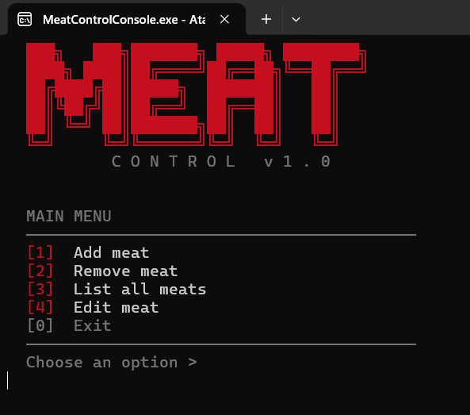

<div align="center">

# 🥩 meat-control-console

**A real-world C# console application to manage daily operations of a meat business.**  
Built to solve an actual problem. Used in production by my father's business every week.


</div>

---

## 📌 Why this project exists

My father runs a small meat business. Every day he needs to track which cuts are available, their prices, and quantities. Before this app, everything was done manually on paper — slow, error-prone, and hard to review later.

I built `meat-control-console` to replace that. It's a straightforward CRUD application that lets him (or whoever is at the counter) register, edit, list, and delete meat cuts — with every session automatically saved to a daily file for record-keeping.

This isn't a tutorial project. It solves a real operational pain and runs in a real environment.

---

## 🖥️ Application preview

<div align="center">
  
</div>

---

## ✅ Features

- Register meat cuts with name and price.
- List all registered cuts in a formatted view
- Edit any field of an existing cut
- Delete a cut by ID with existence validation
- Automatic daily persistence — every session is saved to a `.txt` file
- Data is loaded automatically on startup from the last saved session
- No external dependencies — runs entirely on .NET base class library

---

## 🗂️ Data modeling

### `MeatCut`

The core domain entity representing a single meat cut entry.

| Property   | Type      | Description                          |
|------------|-----------|--------------------------------------|
| `Id`       | `int`     | Unique identifier, auto-incremented  |
| `Name`     | `string`  | Name of the meat cut                 |
| `Price`    | `decimal` | Price per unit (decimal for precision)|

> `decimal` is used instead of `double` to avoid floating-point precision errors — critical when dealing with prices.

### `MeatSummary`

A read-only summary model used for display and reporting purposes, with private setters to prevent unintended mutation outside the domain layer.

---

## 🏗️ Architecture

The project follows a **layered architecture** with clear separation of responsibilities:

```
meat-control-console/
├── Entities/          → Domain models (MeatCut, MeatSummary)
├── Repositories/      → Data access layer (IMeatRepository + implementation)
├── Services/          → Business logic and orchestration
├── UI/                → Display title UI and style formations
├── Utils/             → File I/O helpers, formatting, shared utilities
└── Program.cs         → Entry point and dependency wiring
```

### Layer responsibilities

| Layer          | Responsibility                                                   |
|----------------|------------------------------------------------------------------|
| `Entities`     | Domain objects with proper encapsulation                         |
| `Repositories` | All file reading/writing; isolated behind `IMeatRepository`      |
| `Services`     | Business rules; coordinates between repository and console UI    |
| `Utils`        | Cross-cutting concerns: path resolution, formatting, parsing     |

---

## 🔧 Key technical decisions

### Interface-based repository (`IMeatRepository`)
The repository is abstracted behind an interface. This decouples the service layer from any specific persistence strategy — switching from TXT files to a database in the future requires changing only the repository implementation, not the business logic.

### Manual dependency injection
Dependencies are injected through constructors without a framework. This keeps the project simple while still applying the Dependency Inversion Principle — services depend on abstractions, not concrete implementations.

### `IParsable<T>` for deserialization
The entities implement `IParsable<T>`, enabling type-safe, generic parsing when loading data from TXT files. This avoids scattered string manipulation and makes deserialization consistent and reusable.

### `decimal` for prices
Financial values always use `decimal`, not `double`. `double` is a binary floating-point type and cannot represent values like `0.10` exactly — this causes rounding errors that are unacceptable in a pricing context.

### Dynamic file path resolution
The session file path is resolved at runtime using `Environment.GetFolderPath()`, not hardcoded. This ensures the app works correctly on any machine, regardless of the username or system configuration.

```csharp
// Example: resolves to Documents/MeatConsole/session_2025-06-01.txt
var folder = Environment.GetFolderPath(Environment.SpecialFolder.MyDocuments);
var path = Path.Combine(folder, "MeatConsole", $"session_{DateTime.Today:yyyy-MM-dd}.txt");
```

---

## 🐛 Problems solved during development

| Problem | Root cause | Solution applied |
|---|---|---|
| App crashed on different machines | Hardcoded absolute file path | Dynamic resolution via `Environment.GetFolderPath()` |
| Price rounding errors | `double` used for prices | Replaced with `decimal` across the entire domain |
| `IdExists()` always returned `false` | Logic bug in comparison | Corrected the equality check in repository |
| `MeatCut` fields were public | Defined as fields, not properties | Converted to auto-properties with proper access modifiers |
| `MeatSummary` allowed external mutation | All setters were public | Applied private setters to enforce immutability |
| Unused code increasing complexity | Leftover no-op `GetAll()` call in `EditMeat` | Removed the dead call, kept code clean |

---

## 🚀 How to use

### Prerequisites

- [.NET SDK 10.0+](https://dotnet.microsoft.com/download) installed
- Any terminal (Windows, Linux, macOS)

### Clone and run

```bash
git clone https://github.com/GuilhermeCristaldoDev/meat-control-console.git
cd meat-control-console
dotnet run
```

### Where data is saved

On first run, the app creates the directory automatically:

```
Windows:  C:\Users\{YourUser}\Documents\MeatConsole\session_yyyy-MM-dd.txt
Linux:    /home/{user}/Documents/MeatConsole/session_yyyy-MM-dd.txt
```

Each day generates a new file. The previous session is loaded automatically on startup.

---

## 📦 How to download the executable (.exe)

### Option 1 — Build it yourself

Generate a self-contained executable (no .NET installation required on the target machine):

```bash
# Windows (x64)
dotnet publish -c Release -r win-x64 --self-contained true -p:PublishSingleFile=true

# The .exe will be at:
# bin/Release/net10.0/win-x64/publish/meat-control-console.exe
```

### Option 2 — Download from GitHub Releases

Pre-built binaries are available on the [Releases page](https://github.com/GuilhermeCristaldoDev/meat-control-console/releases).  
Download the `.exe` for Windows, double-click to run — no installation needed.

---

## 👤 Author

**Guilherme Cristaldo**  
Systems Analysis and Development student — IT support professional — aspiring back-end developer.

This project was built to solve a real problem in my family's business and to practice clean C# architecture outside of tutorials.  
Currently working on an ASP.NET Core REST API as the next portfolio piece.

[](https://linkedin.com/in/guilherme-cristaldo)
[](https://github.com/GuilhermeCristaldoDev)

---

<div align="center">
<sub>Built with C# · Driven by a real problem · Used in production</sub>
</div>
